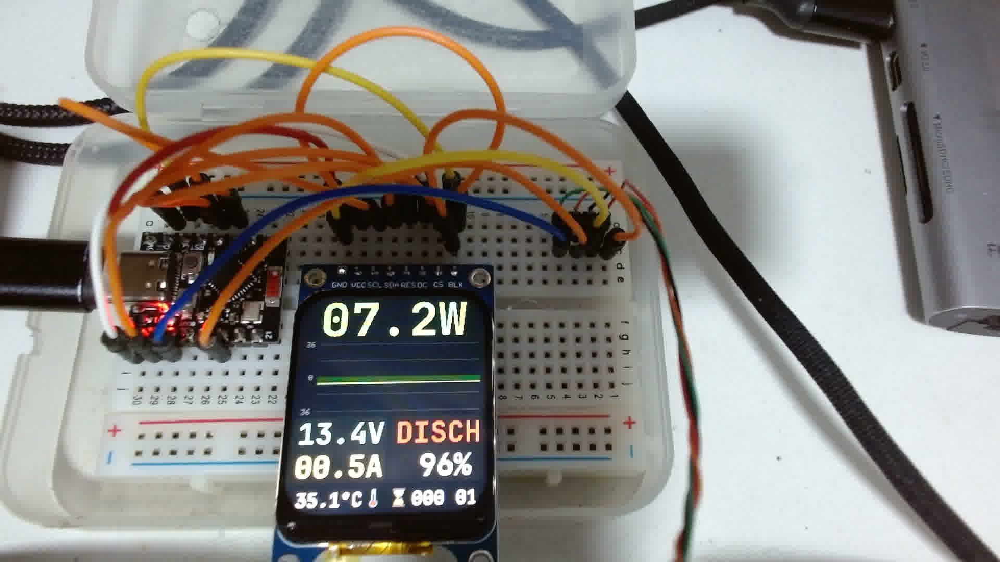

# powerMeterDC

DC power meter for a 4S LiFePO4 battery pack, built around an ESP32-C3
SuperMini, an ST7789V3 IPS display and an INA226 current/voltage monitor.
It shows live power, voltage, current, charge/discharge state and an
estimated state of charge, with a scrolling power-trend chart.



## Hardware

| Part | Notes |
|---|---|
| ESP32-C3 SuperMini | esp32 Arduino core 3.x, native USB CDC |
| ST7789V3 TFT | 1.69" IPS, 240x280, SPI |
| INA226 module | I2C, onboard R100 shunt pads |
| Battery pack | 4S LiFePO4, EVE IFR40135 cells (3.2 V, 20 Ah, 64 Wh each) |

### Display wiring (SPI)

| TFT pin | ESP32-C3 |
|---|---|
| SCL/SCK | GPIO4 |
| SDA/MOSI | GPIO3 |
| RES/RST | GPIO2 |
| DC | GPIO5 |
| CS | GPIO6 |
| BLK | 3V3 (always on for now) |

### INA226 wiring (I2C)

| INA226 pin | ESP32-C3 |
|---|---|
| SDA | GPIO10 |
| SCL | GPIO7 |

GPIO10 was chosen because it is one of the few fully free pins on the
SuperMini (no strapping role, no onboard LED). The I2C address does not
need configuring: init scans the bus and identifies the chip by its ID
registers, so any strap combination (0x40..0x4F) works.

### Shunt

The INA226 shunt ADC has a fixed +/-81.92 mV full scale, so the shunt value
sets the measurable range. This build stacks **3 identical R100 resistors in
parallel** on the module pads (33.3 mOhm):

```
I_max = 81.92 mV / 33.3 mOhm = +/-2.46 A     (~36 W at 14.6 V)
```

Each additional stacked resistor widens the range by 0.82 A. The count
lives in one constant (`SHUNT_PARALLEL_N`); chart scale, current math and
the overload threshold all derive from it. Currents beyond the range do not
damage the chip — the reading saturates and the display reports `OVLD`.

For the pack's full 10 A standard discharge a purpose-made low-milliohm
external shunt is required (an R100 at 10 A would drop 1 V and dissipate
10 W); swapping it is a one-constant change.

## Firmware

Single sketch (`powerMeterDC.ino`), Arduino framework, no external sensor
library — the INA226 is driven at register level.

### Display pipeline

- **Adafruit ST7789 instead of TFT_eSPI**: TFT_eSPI 2.5.43 writes raw SPI
  registers and boot-loops on ESP32-C3 with esp32 core 3.x
  (`REG_SPI_BASE(SPI2_HOST)` resolves to address 0 → store access fault).
- **Full-frame canvas**: the whole 240x280 frame is drawn into a
  `GFXcanvas16` (~131 KB heap) and pushed in one blit at 5 Hz — no flicker,
  no partial redraw bookkeeping.
- **Custom fonts**: JetBrains Mono Bold converted with Adafruit's
  `fontconvert` (sources and generated headers in `fonts/`). Monospace keeps
  digit columns stable as values change. The footer font uses charset
  32..176 to carry the degree sign. Custom GFX fonts render from the
  baseline and ignore background color; the classic 5x7 font remains for
  chart axis labels.
- **Rounded glass**: the panel's corners intrude ~28 px into the active
  area (`GLASS_CORNER_R`), so edge content is inset accordingly.

### Measurement

- Register-level INA226 driver: bus voltage (1.25 mV/LSB) and shunt voltage
  (2.5 uV/LSB) are read directly; current is computed in firmware as
  `I = Vshunt / SHUNT_OHMS`. The calibration register is unused, which keeps
  shunt changes a one-constant edit.
- Config `0x4527`: 16-sample averaging, 1.1 ms conversions, continuous
  shunt+bus — a fresh averaged reading every ~35 ms.
- **Auto-detection**: init scans every I2C address in both SDA/SCL pin
  orientations and verifies the manufacturer (0x5449 "TI") and die (0x2260)
  IDs, then adopts whatever address the module straps selected. The periodic
  serial line reports the detection (or the full scan result on failure).
- **Fault states**, in priority order on the main value: red `ERROR` when
  any I2C transaction fails (checked every cycle — covers a wire falling off
  mid-run), red `OVLD` while the shunt ADC is saturated. While the sensor is
  absent the firmware retries detection every 2 s, so plugging it back
  recovers the meter without a reboot. Rationale: a clipped or stale number
  looks plausible and misleads; an explicit fault state does not.
- Positive current = discharge (flow IN+ → IN-); a 10 mA deadband keeps
  offset noise from flickering the charge/discharge label, and below 0.1 A
  the state shows `IDLE`.
- `SIM_WHEN_ABSENT` (default off) replaces missing-sensor `ERROR` with a
  simulated sweep, for UI work on a bare bench.

### State of charge

Voltage-based estimate for the 4S pack: per-cell voltage is interpolated
over two lookup tables (charge and discharge) built from the EVE IFR40135
datasheet curves; the table is selected by current direction to compensate
hysteresis and IR shift. LiFePO4 sits on a very flat plateau (3.2–3.3 V per
cell from ~20% to ~90%), so mid-range values are coarse estimates — accurate
near the knees and at rest. Coulomb counting with voltage re-anchoring is
the planned refinement.

### Dashboard conventions

- Hero value: instantaneous |P| in watts.
- Trend chart: charge rises above the zero baseline, discharge dips below,
  single color, unsigned axis labels; full scale derives from the shunt
  configuration (`PCHART_MAX`).
- Left column: pack voltage, |I|. Right column: `CHARG`/`DISCH`/`IDLE` and
  SoC. Footer: chip temperature and uptime (HHH:MM, blinking colon).

## Building and flashing

Requires `arduino-cli` with the esp32 core (3.x) and the libraries
`Adafruit GFX`, `Adafruit ST7735 and ST7789`, `Adafruit BusIO`.

```sh
./arduinocli-esp32c3.sh            # compile and flash (port auto-detected)
./arduinocli-esp32c3.sh compile    # compile only
./arduinocli-esp32c3.sh monitor    # serial monitor (115200)
./arduinocli-esp32c3.sh reset      # reset the board without flashing
```

FQBN: `esp32:esp32:esp32c3:UploadSpeed=921600,CDCOnBoot=cdc` — serial goes
to the native USB port, no UART bridge needed.

To regenerate fonts, compile `fontconvert` from the Adafruit GFX library
(needs freetype) and run it over the TTFs in `fonts/`.

## Roadmap

- Coulomb counting (20 Ah capacity) with voltage re-anchoring at the curve
  knees for a drift-free SoC.
- Always-on battery-side power: deep sleep between refreshes, backlight on
  a GPIO, display sleep-in — targeting tens of uA average, far below the
  pack's own self-discharge.
- External low-milliohm shunt to cover the pack's 10 A standard discharge.
